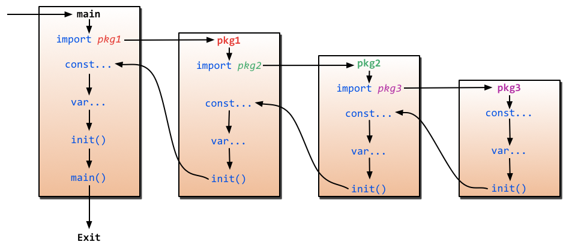

# init（） 函数何时运行？

## 问题

我试图找到一个关于 init（） 函数在 Go 中的作用的精确解释。我阅读了 Effective Go 所说的内容，但我不确定我是否完全理解了它所说的内容。我不确定的确切句子如下：

> finally 表示 finally：init 在包中的所有变量声明都计算了它们的初始值设定项之后被调用，并且这些变量声明只有在所有导入的包都初始化后才被计算。

这 all the variable declarations in the package have evaluated their initializers 是什么意思？这是否意味着如果你在一个包及其文件中声明了 “全局” 变量，init（） 不会运行，直到它的所有变量都被计算出来，然后它将运行所有的 init 函数，然后在运行 ./main_file_name 时运行 main（）？

我还阅读了 Mark Summerfield 的 go book 以下内容：

> 如果一个包有一个或多个 init（） 函数，它们会在调用主包的 main（） 函数之前自动执行。

在我的理解中，init（） 仅在你打算运行 main（） 时才有意义，对吗？任何人如果对init（）理解的更准确请随时纠正我

## 回答1


是的，假设你有[这个 ](http://play.golang.org/p/dvHymTy73F)：

```go
var WhatIsThe = AnswerToLife()

func AnswerToLife() int { // 1
    return 42
}

func init() { // 2
    WhatIsThe = 0
}

func main() { // 3
    if WhatIsThe == 0 {
        fmt.Println("It's all a lie.")
    }
}
```

`AnswerToLife（）` 保证在调用 `init（）` 之前运行，并且保证 `init（）` 在调用 `main（）` 之前运行。

请记住，无论是否有 `main，init（）` 总是被调用的，因此如果你导入一个具有 `init` 函数的包，它将被执行。

此外，每个包可以有多个 `init（）` 函数;它们将按照它们在文件中显示的顺序执行（当然，在所有变量都初始化之后）。如果它们跨越多个文件，它们将按词法文件名顺序执行（如 [@benc](https://stackoverflow.com/users/2039413/benc) 所指出的那样）：

> init`（）` 函数似乎是按词法文件名顺序执行的。Go 规范说“鼓励构建系统以词法文件名顺序将属于同一包的多个文件呈现给编译器”。看起来 `go build` 是这样工作的。

许多内部 Go 包使用 `init（）` 来初始化表等，例如 [https://github.com/golang/go/blob/883bc6/src/compress/bzip2/bzip2.go#L480](https://github.com/golang/go/blob/883bc6/src/compress/bzip2/bzip2.go#L480)

## 回答2


请看这张图片。:)

`import --> const --> var --> init()`


1. 如果一个 package 导入了其他 package，则首先初始化导入的 package。
2. 然后初始化当前包的常量。
3. 然后初始化当前包的变量。
4. 最后，调用当前包的 init（） 函数。

> 一个包可以有多个 init 函数（在单个文件中或分布在多个文件中），并且它们按照呈现给编译器的顺序进行调用。

> 一个 package 将只初始化一次，即使它是从多个 package 中导入的。

## stackoverflow链接

https://stackoverflow.com/questions/24790175/when-is-the-init-function-run
